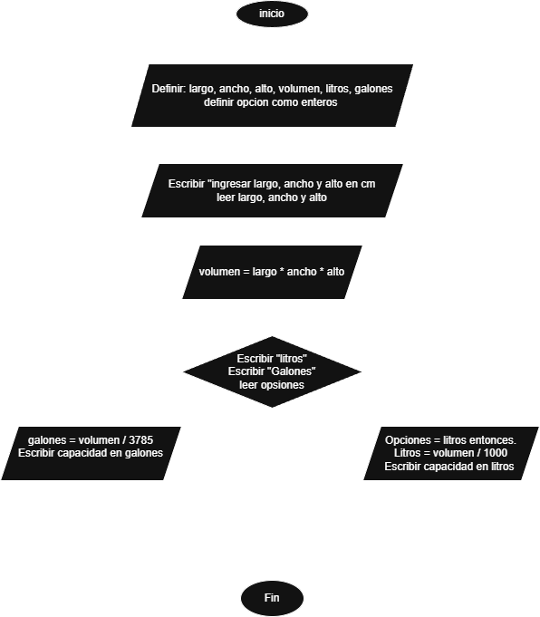
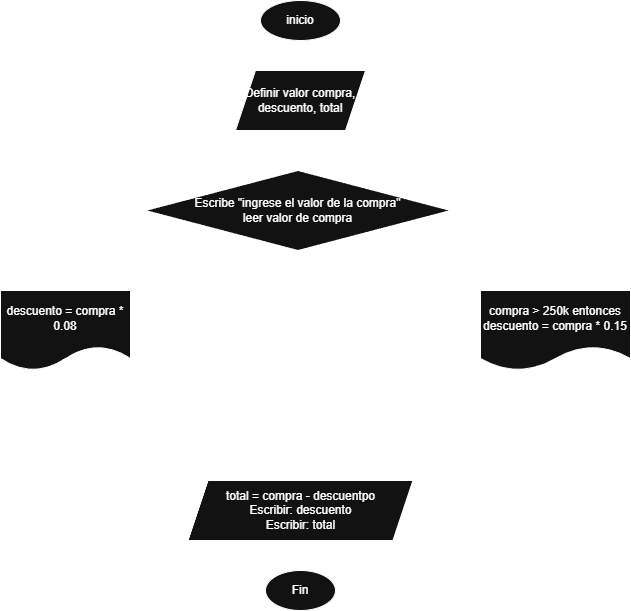
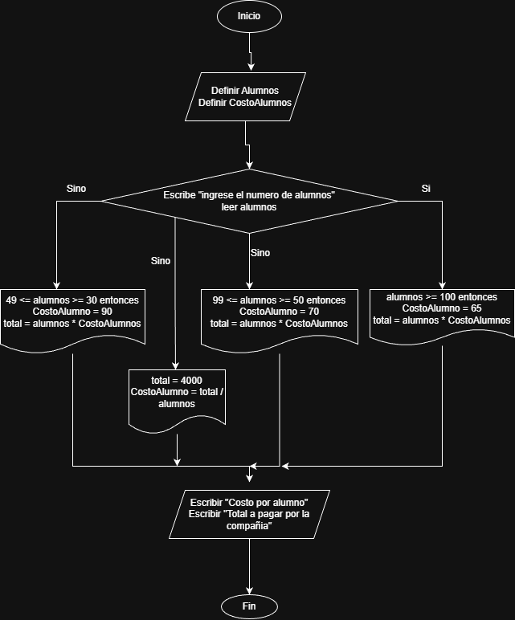

# Actividad 2
## 📤 Ejercicio 1.

Investiga cuáles son los símbolos que se utilizan para representar cada operación de un algoritmo con un diagrama de flujo. Asegúrate de que la fuente es confiable, discute lo que encontraste con tus compañeros y con el profe. Cuando estés seguro/a de tener los símbolos correctos, consigna la información en la bitácora.

## Ejercicio 2.

    Construye un algoritmo que, al recibir como datos el ID del empleado y los seis primeros sueldos del año, calcule el ingreso total semestral y el promedio mensual, e imprima el ID del empleado, el ingreso total y el promedio mensual.

    Inicio del algoritmo

        Algoritmo Sueldo Semestral

        Definir ID como entero
        Definir s1, s2, s3, s4, s5, s6 como real
        Definir total, promedio como real

        Escribir "Ingrese ID del empleado:"
        Leer ID

        Escribir "Ingrese los 6 sueldos del año:"
        Leer s1, s2, s3, s4, s5, s6

        total ← s1 + s2 + s3 + s4 + s5 + s6
        promedio = total / 6

        Escribir "ID del empleado: ", ID
        Escribir "Ingreso total semestral: ", total
        Escribir "Promedio mensual: ", promedio

    Fin del algoritmo

## Ejercicios 3. Un **acuario** necesita determinar cuántos litros o
    
    1. Un acuario necesita determinar cuántos litros o galones (eso lo decide el usuario) de agua caben en un acuario, pero solo dispone de una cinta métrica (en centímetros). Diseña un algoritmo para solucionar el problema. 

        Algoritmo Acuario

    Definir largo, ancho, alto, volumen, litros, galones
    Definir opcion Como Entero

    Escribir "Ingrese largo, ancho y alto en cm:"
    Leer largo, ancho, alto

    volumen = largo * ancho * alto

    Escribir "Litros"
    Escribir "Galones"
    Leer opcion

    Si opcion = Litros Entonces
        litros = volumen / 1000
        Escribir "Capacidad en litros: " litros
    Sino
        galones = volumen / 3785
        Escribir "Capacidad en galones: " galones
    Fin Si

FinAlgoritmo

## ejercico 4. cuanto pagar por x cantidad 

    2. Realice un algoritmo para determinar cuánto se debe pagar por equis cantidad de lápices considerando que si son 1000 o más el costo es de $85 cada uno; de lo contrario, el precio es de $90. Represéntelo con el pseudocódigo y el diagrama de flujo.
        
|variable| inicio  | fin |
|--------|----|---|
|cantidad|  0 | N.lapices  |
|presio  |  0 | valor  |
| total  |  0 | total a pagar  |

        Algoritmo PagoLapices

        Definir cantidad, precio, total

        Escribir "Ingrese la cantidad de lapices:"
        Leer cantidad

        Si cantidad >= 1000 Entonces
            precio = 85
        Sino
            precio = 90
        FinSi

        total = cantidad * precio

        Escribir "Precio por lapiz:" precio
        Escribir "Total a pagar:" total

        FinAlgoritmo

    3. Un almacén de ropa tiene una promoción: por compras superiores a $250 000 se les aplicará un descuento de 15%, de caso contrario, sólo se aplicará un 8% de descuento. Realice un algoritmo para determinar el precio final que debe pagar una persona por comprar en dicho almacén y de cuánto es el descuento que obtendrá. Represéntelo mediante el pseudocódigo y el diagrama de flujo.

|compra|compra > 250k|descuento|valor del descuento|presioT|
|---|---|---|---|---|
|200k| no  | 8%  | 16k  | 184k  |
|250k|  no | 8%  |  20k | 230k  |
|300k| si  | 15%  | 45k  | 255k  |

        Algoritmo DescuentoAlmacen

        Definir compra, descuento, precioFinal Como Real

        Escribir "Ingrese el valor de la compra"
        Leer compra

        Si compra > 250000 Entonces
            descuento = compra * 0.15
        Sino
            descuento = compra * 0.08
        FinSi

        precioFinal = compra - descuento

        Escribir "Descuento obtenido:" descuento
        Escribir "Precio final a pagar:" precioFinal

        FinAlgoritmo

    4. El director de una escuela está organizando un viaje de estudios, y requiere determinar cuánto debe cobrar a cada alumno y cuánto debe pagar a la compañía de viajes por el servicio. La forma de cobrar es la siguiente: si son 100 alumnos o más, el costo por cada alumno es de $65.00; de 50 a 99 alumnos, el costo es de $70.00, de 30 a 49, de $95.00, y si son menos de 30, el costo de la renta del autobús es de $4000.00, sin importar el número de alumnos.
|Numero de alumnos   |Costo por alumnos   |
|---|---|
|  mayor o igual a 100 | 65  |
|  99 a 50 |  70 |
| 49 a 30  |  95 |
| menor que 30|4000|         
       
        Algoritmo ViajeEstudios

        Definir alumnos
        Definir costoAlumno

        Escribir "Ingrese el numero de alumnos"
        Leer alumnos

        Si alumnos >= 100 Entonces
            costoAlumno = 65
            total = alumnos * costoAlumno

        Sino Si 99 <= alumnos >= 50 Entonces
            costoAlumno = 70
            total = alumnos * costoAlumno

        Sino Si 49 <= alumnos >= 30 Entonces
            costoAlumno = 95
            total = alumnos * costoAlumno

        Sino
            total = 4000
            costoAlumno = total / alumnos
        FinSi

        Escribir "Costo por alumno" costoAlumno
        Escribir "Total a pagar a la compania" total

        FinAlgoritmo

# 📤 **Consigna tus respuestas en la bitácora**

A continuación, se presentan enunciados relacionados con los temas tratados en el texto. Los estudiantes deben responder si los enunciados corresponden o no con las definiciones o conceptos aprendidos.

### Parte 1: Identificar Algoritmos

Responde si los siguientes enunciados representan un algoritmo. Justifica la respuesta:

1. Una página web.
2. Una receta para hacer un pastel, donde se indican ingredientes y pasos a seguir.  
R/ En una reseta se reprentan paso a paso de como conseguir un resultado 
3. "Piensa en un número y multiplícalo por otro".
4. Un manual de instrucciones para armar un mueble, con pasos detallados y un orden claro.  
R/ se muestan una serie de pasos para conseguir un fin 
5. Una lista de compras organizada en orden alfabético

### Parte 2: Variables y Constantes

Indica si las siguientes afirmaciones describen una variable o una constante:

1. El valor de la gravedad en la Tierra, 9.8 m/s². R/ constante
2. La edad de una persona calculada con base en el año actual y su año de nacimiento. R/ variable
3. La cantidad de dinero en una cuenta bancaria. R/ variable
4. La velocidad de la luz en el vacío, 299,792,458 m/s. R/ constante
5. El radio de un círculo. R/ variable

### Parte 3: Características de los Algoritmos

Responde si los siguientes enunciados cumplen con las características de un algoritmo. Justifica la respuesta:

1. Para elegir la ruta más corta entre varias ciudades, el algoritmo examina rutas candidatas, deteniéndose cuando los cambios en la distancia parecen lo suficientemente pequeños.  
R/ Una serie que elige segun condiciones 
2. Suma los números ingresados y muestra el resultado.
3. Un conjunto de pasos para calcular el área de un rectángulo dado su base y altura.  
R/ si cumple porque ejecuta una serie de pasos 
4. El algoritmo cuenta el número de votos obtenidos por cada uno de los candidatos de una elección para presidente. Empieza solicitando el nombre del candidato y finaliza cuando se ingresa el valor -1.

### Parte 4: Comprensión de Herramientas

Indica si las siguientes afirmaciones son ciertas o falsas respecto al pseudocódigo y diagramas de flujo:

1. El pseudocódigo utiliza símbolos estándar para representar las operaciones lógicas.  R/ falsas
2. Los diagramas de flujo son una representación gráfica de un algoritmo.  R/ verdadera
3. El pseudocódigo debe estar escrito en un lenguaje de programación específico.  R/ falsa
4. Un diagrama de flujo siempre debe tener un inicio y un fin claramente definidos.  R/ verdadera

### Parte 5: Estructuras de Control

Describe para qué sirven las estructuras de control. Redacta dos ejemplos, uno de tu vida diaria, es decir cuando tienes que tomar decisiones en tus actividades diarias y oto ejemplo en el que se tengan que utilizar cálculos matemáticos para tomar una u otra decisión

¿Para qué sirven las estructuras de control?

Las estructuras de control permiten controlar el flujo de ejecución de un algoritmo o programa.

Sirven para:

- Tomar decisiones (Si – Entonces – Sino)

- Repetir acciones (Mientras, Para, Repetir)

- Controlar cuántas veces se ejecuta algo

- Evaluar condiciones

Sin estructuras de control, un programa solo ejecutaría instrucciones en orden, sin poder decidir ni repetir.

Se dividen en tres tipos:

Secuenciales: instrucciones en orden.

Selectivas (condicionales): toman decisiones.

Repetitivas (ciclos): repiten procesos.

    Ejemplo 1: Vida diaria (toma de decisiones)

    Situación: Decidir si llevar paraguas.

    Si está lloviendo, llevo paraguas; si no, no lo llevo.

    En pseudocódigo:

    Si estaLloviendo = Verdadero Entonces
    Llevar paraguas
    Sino
        No llevar paraguas
    FinSi

