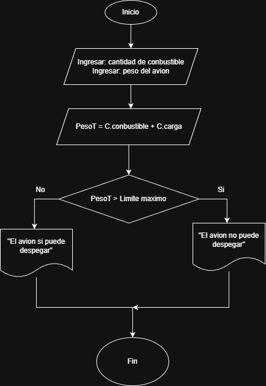

# Taller de Algoritmos
    
1. **Verificación de peso de despegue**
    
    En una pista de pruebas de aeronaves, el sistema debe verificar si el peso total de la aeronave, incluyendo combustible y carga, supera el límite máximo permitido para el despegue. Dependiendo del resultado, el sistema deberá indicar si la aeronave está lista para despegar o si debe reducir carga o combustible.  

2. **Control de combustible en pruebas**
    
    Durante un ensayo en banco de un motor a reacción, se mide el nivel de combustible cada minuto y se detiene el registro cuando el combustible baja del 10%. Mostrar el tiempo total de operación antes de llegar a ese punto.

        InicioAlgoritmo

        combustible = cantidad de conbustible
    
        limite = combustible * 0.10
        minutos = 0

        mientras combustible > limite:
            minutos = minutos + 1

            leer conbustible
        finMientras
        mostrar combustible
        finAlgoritmo 

3. **Control de temperatura en cabina**
    
    Un sistema mide cada 5 minutos la temperatura en cabina durante una hora. Si en algún momento se detecta una temperatura mayor a 27°C o menor a 18°C, debe indicar que se active el sistema de climatización.

        temperatura = valor

        para i 1 hasta 12:
            leer temperatura 
            
            si temperatura 27 < temperatura < 18:
                imprimir se activo climatizador
            finSi
        finpara
        fin